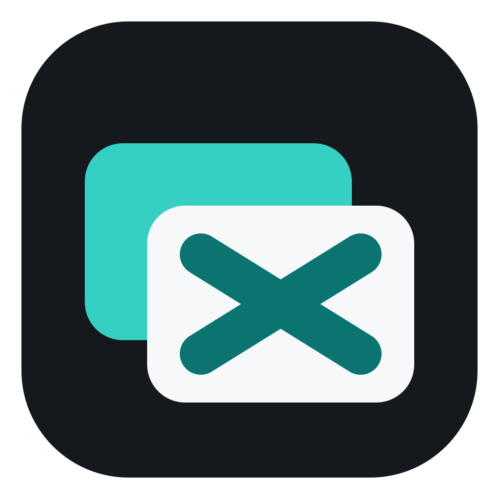
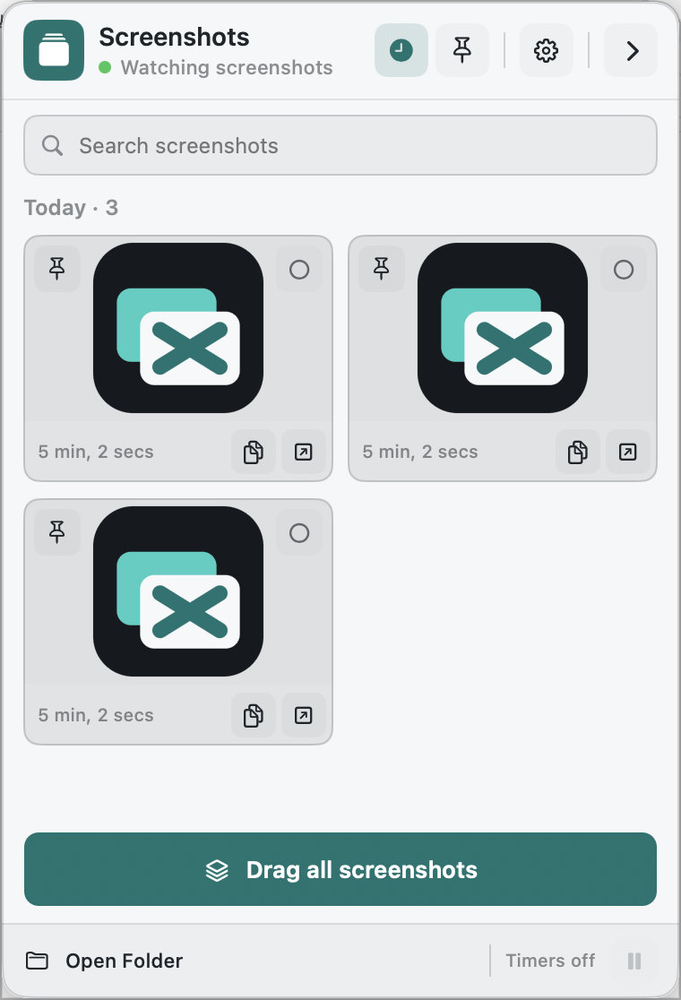
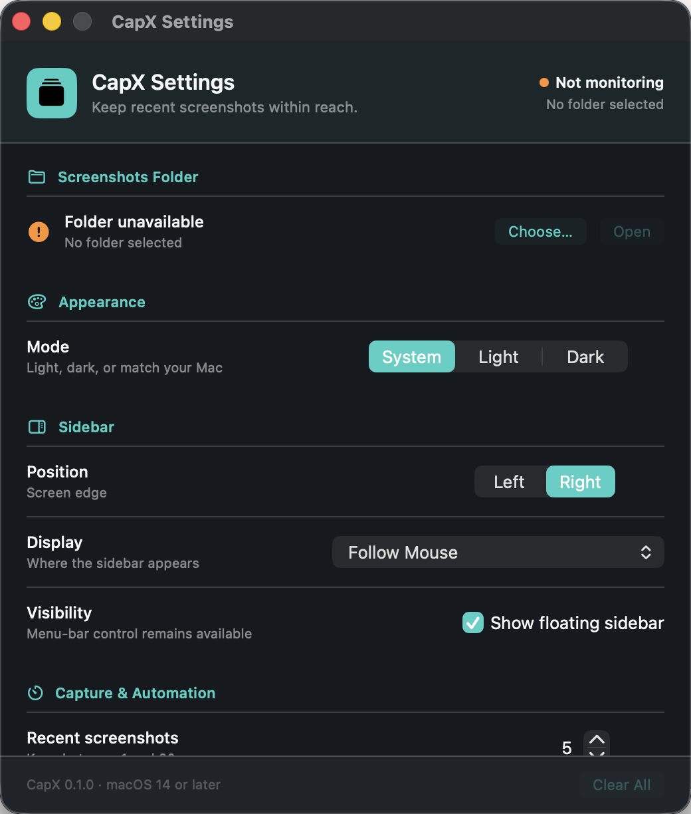

<p align="center">
  
</p>

<h1 align="center">CapX</h1>

<p align="center">
  A local-first screenshot shelf for macOS.
</p>

<p align="center">
  <a href="https://github.com/withNoclout/capx/actions/workflows/ci.yml"></a>
  <a href="LICENSE"></a>
  
</p>

CapX watches a folder for newly saved images and keeps the latest screenshots in a floating sidebar. Pin, search, copy, open, reveal, or drag captures into another app without hunting through Finder.

CapX does **not** take screenshots itself. It observes files written to the folder you select, using public macOS APIs only.

| Floating screenshot shelf | Settings |
| --- | --- |
|  |  |

_All screenshots above contain synthetic project artwork only._

## Features

- **Folder monitoring** — watches a user-selected folder for new image files.
- **Recent and Pinned collections** — keeps important captures within reach for the current session.
- **Fast actions** — open, reveal in Finder, copy as file references, dismiss, or drag screenshots.
- **Multi-file drag** — select multiple cards or drag the whole visible collection together.
- **Display-aware sidebar** — follow the mouse across connected displays, use the main display, or choose a specific display.
- **Left or right edge** — place the shelf on either side of the selected display.
- **Search and limits** — filter captures and keep between 1 and 20 recent items.
- **Idle automation** — temporarily hide the panel or clear unpinned entries after configurable inactivity.
- **Native appearance** — System, Light, and Dark modes using original CapX palettes.
- **Local-only design** — no account, network client, analytics, telemetry, or screenshot upload.

## Requirements

- macOS 14 Sonoma or later
- Apple Silicon or Intel Mac

## Install

### Build from source

Install Xcode or the Swift command-line tools, then run:

```sh
git clone https://github.com/withNoclout/capx.git
cd capx
swift build
swift test
./Scripts/build-app.sh release
open dist/CapX.app
```

`build-app.sh` creates a local ad-hoc-signed app. It is intended for development and does not replace Developer ID signing or notarization.

### Release download

Published binaries appear on the [Releases](https://github.com/withNoclout/capx/releases) page. Only a release that explicitly states that it is Developer ID signed, notarized, and stapled should be treated as a Gatekeeper-ready distribution. Release archives include a SHA-256 checksum.

## Use

1. Launch CapX from the menu bar.
2. Choose the folder where macOS or your screenshot tool saves images.
3. Take a screenshot normally. New image files appear in the floating shelf.
4. Use the card controls to pin, copy, open, select, or dismiss a capture.
5. Drag a card—or **Drag all screenshots**—into Mail, Messages, Finder, an editor, or another app that accepts files.

Dismiss and Clear All affect the CapX interface only. They never delete the original files.

## Privacy

CapX reads only the folder you choose, stores its bookmark and preferences in the current user's local defaults, and keeps capture collections in memory. It has no application networking code and does not request Screen Recording permission.

See [`PRIVACY.md`](PRIVACY.md) for the complete data-handling policy.

## Development

```sh
swift build
swift test
```

Package a native development build:

```sh
./Scripts/build-app.sh debug
```

Reproduce the committed application icon:

```sh
swift Scripts/generate-icon.swift
```

The project uses AppKit for lifecycle, windows, menus, pasteboard, and drag behavior; SwiftUI for hosted presentation; Dispatch for directory monitoring; and ImageIO for off-main thumbnail downsampling. It has no third-party package dependencies.

## Project policies

- Contributions: [`CONTRIBUTING.md`](CONTRIBUTING.md)
- Security reports: [`SECURITY.md`](SECURITY.md)
- Privacy: [`PRIVACY.md`](PRIVACY.md)
- Third-party notices: [`THIRD_PARTY_NOTICES.md`](THIRD_PARTY_NOTICES.md)
- CapX name and icon: [`TRADEMARKS.md`](TRADEMARKS.md)

Source code is available under the [MIT License](LICENSE). The CapX name and application icon are reserved brand assets; distributed forks must follow the trademark policy.
